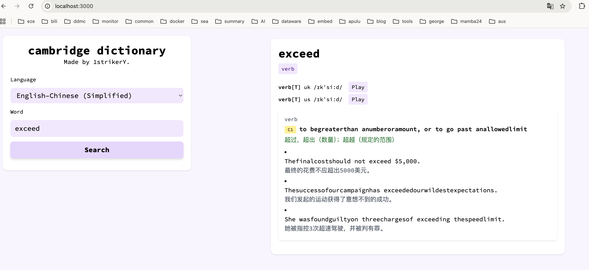

# Cambridge Dictionary (Python)

A simple API for Cambridge Dictionary, built with FastAPI.
Try It Online : https://cambridge-dictionary-diy.vercel.app/

## 🚀 项目亮点
- 数据持久化与优先命中：集成 Supabase，查询先读库命中，未命中再抓取并写库。
- 结构化存储：将词条主体与义项明细拆分两表，便于查询与扩展。
- 解析准确性：修正文本解析空格问题，保留定义与例句中的自然分隔。
- 动词变形支持：接入 Simple Wiktionary 提供常见动词变形。
- 轻量缓存：内置 TTL+LRU 内存缓存，加速热词访问。

## 🧩 核心能力
- 接口：`/api/dictionary/{language}/{word}`
- 语种：`en`（美式）、`uk`（英式）、`en-cn`（英–中简）、`en-tw`（英–中繁）
- 返回字段：
  - `word`、`pos[]`
  - `pronunciation[]`（`pos`、`lang`、`url`、`pron`）
  - `definition[]`（`id`、`pos`、`source`、`text`、`translation`、`level`、`example[]`）
  - `verbs[]`

## 🗄️ Supabase 持久化
- 表关联：
  - `dictionary_entries`（主体）一对多 `dictionary_senses`（义项）
  - 关联键：`dictionary_senses.entry_id → dictionary_entries.id`
- 字段要点：
  - `dictionary_entries`：`language_slug`、`source_language`、`target_language`、`entry`、`word`、`pos`、`pronunciation`、`verbs`、`data(jsonb)`
  - `dictionary_senses`：`entry_id`、`pos`、`source`、`original_content`、`translated_result`、`level`、`examples(jsonb)`
- 写入策略：
  - 优先写入 `data` 原始 JSON；若 Supabase 未添加 `data` 列或模式缓存未刷新，自动降级为不写 `data`，仍保证主体与义项入库。

## 🔐 配置与密钥
- 在项目根目录创建 `.secret` 文件（已加入 `.gitignore`，不会提交）：
```
SUPABASE_URL=你的项目URL
SUPABASE_KEY=你的服务密钥
```
- 服务端密钥建议使用 `service_role`，以避免 RLS 写入受限；若使用 `anon/authenticated`，需为两表开放 `insert/update/select` 策略。

## 📦 使用方式（本地）
```bash
# 创建虚拟环境并安装依赖
python3 -m venv .venv
. .venv/bin/activate
pip install -r requirements.txt

# 在 .secret 写入 Supabase 配置后启动
./.venv/bin/python -m uvicorn app.main:app --host 127.0.0.1 --port 3000

# 示例请求
curl http://127.0.0.1:3000/api/dictionary/en-cn/test
curl http://127.0.0.1:3000/api/dictionary/en-cn/hello
```

## 📝 行为说明
- 查询流程：先查 Supabase 命中则直接返回；未命中触发抓取并写入两表后返回。
- 解析规则：定义与例句使用空格分隔文本片段，避免词汇黏连；`source` 在页面取不到时回退为请求的语言标识（如 `en-cn`）。


## 🕹️ Manual

### 📚 dictionary
`/api/dictionary/{language}/{word}`

- language option:
  - `en` — English (US)
  - `uk` — English (UK)
  - `en-cn` — English–Chinese (Simplified)
  - `en-tw` — English–Chinese (Traditional)

Open `/` to use the built-in Web UI.

### Response fields
- `word`: headword
- `pos`: list of parts of speech
- `pronunciation`: list with `pos`, `lang`, `url` (audio), `pron` (IPA)
- `definition`: list per sense, with `id`, `pos`, `source`, `text`, `translation`, `level` (CEFR A1–C2), `example[]`
- `verbs`: verb forms from Simple Wiktionary

### Error codes
- `400` Unsupported language
- `404` Word not found
- `500` Internal server error

## 🌐 Deploy
- Works as a standard Python web app (FastAPI + Uvicorn).
- Can be deployed to platforms supporting long-running processes (Render, Railway, etc.). Vercel serverless requires adapter; run locally is recommended.

## 💻 Running Locally
After cloning, run the following in the project folder:

```bash
# create & activate venv
python3 -m venv .venv
. .venv/bin/activate

# install dependencies
pip install -r requirements.txt

# run
./.venv/bin/python -m uvicorn app.main:app --host 0.0.0.0 --port 3000
./.venv/bin/python -m uvicorn app.main:app --host 127.0.0.1 --port 3000
```

Then fetch `http://localhost:3000` or open `/` for the UI.

## 📖 Example


## API Source
- Verbs from Wiktionary (Simple English)
- Other data from Cambridge Dictionary

## Develop ❤️
- Built with FastAPI, Requests, BeautifulSoup
- In-memory TTL/LRU cache for performance
- Contributions are welcome!
